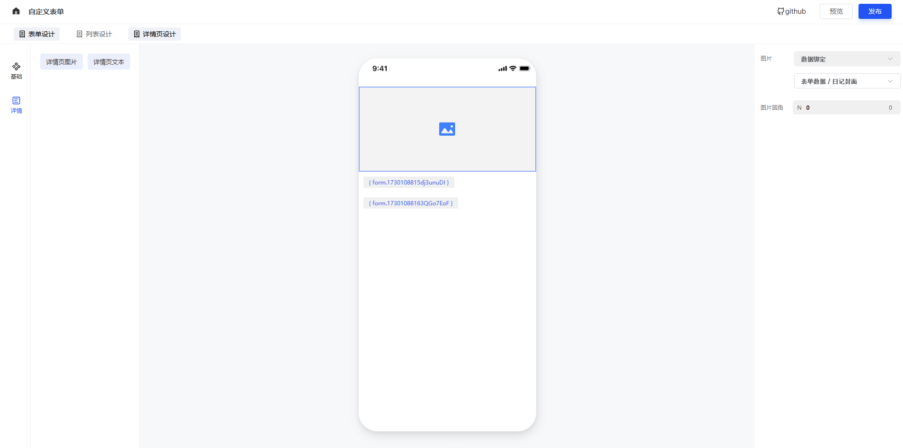

<!--
 * @Description: What's this for
 * @Autor: WangYuan
 * @Date: 2021-12-20 14:20:57
 * @LastEditors: WangYuan
 * @LastEditTime: 2024-10-30 17:44:49
-->
<!-- [English](./README.md) | 简体中文  -->

<p align="center">
  
</p>
<p align="center">
 
 
 
 
</p>

<p align="center">
  云搭万物，触手可及！
</p>

<p align="center">
  零代码搭建小程序、H5、问卷、图文
</p>

## 介绍

云搭是一款功能强大、开源、免费的可视化搭建解决方案，它支持零代码搭建小程序、H5、问卷、图文等多种应用，我致力于提供一套简单、便捷、专业、可靠的多场景零代码平台。

技术栈前端为vue3，后端基于nodejs进行开发

## 线上平台

<p data-tool="mdnice编辑器" style="font-size: 16px; padding-top: 8px; padding-bottom: 8px; margin: 0; line-height: 26px; color: black;">地址：<a href="https://www.sunmao-design.top/sunmao/admin" style="text-decoration: none; color: #1e6bb8; word-wrap: break-word; font-weight: bold; border-bottom: 1px solid #1e6bb8;">传送门</a></p>

## 平台速览


<div style="margin-top: 50px;margin-bottom: 20px; text-align: center; color: #888; font-size: 20px;">搭建小程序</div>


<div style="margin-top: 10px;margin-bottom: 10px; text-align: center; color: #888; font-size: 14px;">- 小程序菜单、页面、表单整流程可视化搭建，构建项目简单、快捷 -</div>


<div style="margin-top: 10px;margin-bottom: 10px; text-align: center; color: #888; font-size: 14px;">- 小程序页面拖拽组件自由搭建 -</div>


<div style="margin-top: 10px;margin-bottom: 10px; text-align: center; color: #888; font-size: 14px;">- 提供卡片、tab等容器组件，让页面支持无限层级嵌套布局 -</div>


<div style="margin-top: 10px;margin-bottom: 10px; text-align: center; color: #888; font-size: 14px;">- 支持图片实时编辑，给用户更多自由设计空间 -</div>


<div style="margin-top: 10px;margin-bottom: 10px; text-align: center; color: #888; font-size: 14px;">- 支持表单自定义构建，满足用户更多自定义需求 -</div>

<div style="margin-top: 50px;margin-bottom: 20px; text-align: center; color: #888; font-size: 20px;">搭建问卷调查</div>


<div style="margin-top: 10px;margin-bottom: 10px; text-align: center; color: #888; font-size: 14px;">- 问卷调查表单自由搭建 -</div>


<div style="margin-top: 10px;margin-bottom: 10px; text-align: center; color: #888; font-size: 14px;">- 提供问卷调查样式设计 -</div>


<div style="margin-top: 10px;margin-bottom: 10px; text-align: center; color: #888; font-size: 14px;">- 问卷提交数据多维度分析 -</div>

<div style="margin-top: 50px;margin-bottom: 20px; text-align: center; color: #888; font-size: 20px;">搭建图文</div>


<div style="margin-top: 10px;margin-bottom: 10px; text-align: center; color: #888; font-size: 14px;">- 搭建图文页面 -</div>

<div style="margin-top: 50px;margin-bottom: 20px; text-align: center; color: #888; font-size: 20px;">搭建自定义表单</div>
<div style="margin-top: 10px;margin-bottom: 10px; text-align: center; color: #888; font-size: 14px;">云搭提供表单-列表-详情页的整链路设计方案，用户可在小程序、H5中任意使用</div>


<div style="margin-top: 10px;margin-bottom: 10px; text-align: center; color: #888; font-size: 14px;">- 搭建表单 -</div> 


<div style="margin-top: 10px;margin-bottom: 10px; text-align: center; color: #888; font-size: 14px;">- 搭建表单列表 -</div>


<div style="margin-top: 10px;margin-bottom: 10px; text-align: center; color: #888; font-size: 14px;">- 搭建表单详情页 -</div>


<div style="margin-top: 10px;margin-bottom: 10px; text-align: center; color: #888; font-size: 14px;">- 在页面使用表单 -</div>


<div style="margin-top: 10px;margin-bottom: 10px; text-align: center; color: #888; font-size: 14px;">- 在页面展示表单数据列表 -</div>


<div style="margin-top: 10px;margin-bottom: 10px; text-align: center; color: #888; font-size: 14px;">- 问卷调查小程序 -</div>


<div style="margin-top: 10px;margin-bottom: 10px; text-align: center; color: #888; font-size: 14px;">- 问卷调查小程序 -</div>


<div style="margin-top: 10px;margin-bottom: 10px; text-align: center; color: #888; font-size: 14px;">- 问卷调查小程序 -</div>


<div style="margin-top: 10px;margin-bottom: 10px; text-align: center; color: #888; font-size: 14px;">- 问卷调查小程序 -</div>

## 开始

### 安装依赖

```bash
pnpm bootstrap
```

必须安装`pnpm`运行项目。

### 运行项目云搭平台

```bash
pnpm dev:dooring
```

### 运行项目云搭渲染器H5

```bash
pnpm dev:render
```

## 版本更新
 ### 1.0 Beat 版本上线

- 小程序、问卷、图文多场景搭建
- 支持uni-app构建多端小程序/APP
- 支持容器组件无限层级嵌套布局
- 支持自定义表单搭建，提供表单-列表-详情页的整链路设计方案
- 开放资源广场，为用户提供更多的模板，帮助用户快速搭建

## 开源不易, 有了您的赞助, 我们会做的更好~

  

<!-- ## 技术反馈与低代码交流群

- 加入低代码交流群交流
- 获取低代码开发教程文章
- 与作者进行相关交流

 -->
